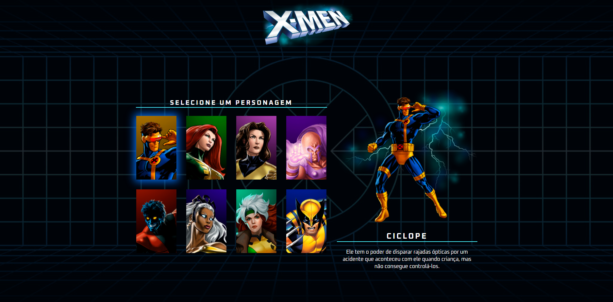

# X-Men Character Selector 🧬

Aplicação web que permite visualizar informações dos personagens dos X-Men ao passar o mouse sobre os cards.



---

## ✨ Funcionalidades

- Destaque visual para o personagem selecionado
- Atualização dinâmica de imagem, nome e descrição
- Scroll suave em telas pequenas
- Design responsivo

---

## 🚀 Tecnologias

- HTML
- CSS
- JavaScript (Vanilla)

---

## ▶️ Como usar

1. Clone o repositório:
```bash
git clone https://github.com/cayohenryck/projeto-xmen